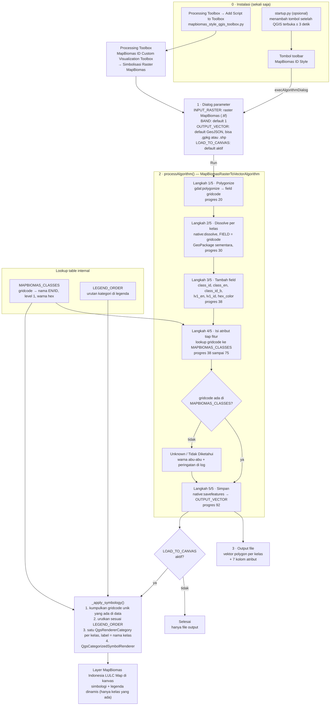
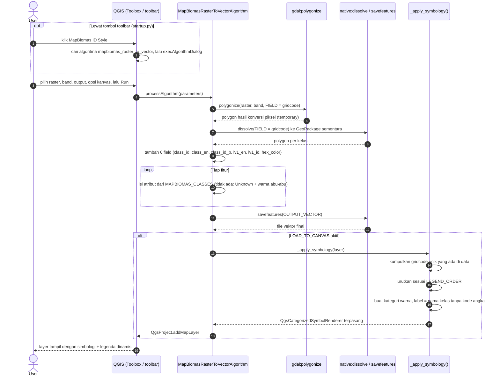

# MapBiomas ID Style — QGIS Toolbox

Toolbox QGIS untuk simbolisasi otomatis raster **MapBiomas Indonesia** menjadi vektor polygon berlabel dan berwarna sesuai kelas tutupan lahan (LULC).

> **Catatan:** Toolbox ini dibuat sebagai bentuk apresiasi terhadap proyek MapBiomas Indonesia dan untuk memudahkan pengguna QGIS dalam memvisualisasikan data tutupan lahan tanpa perlu setting simbologi manual. Semua kredit data sepenuhnya milik tim **MapBiomas Indonesia**.

---

## Sistem Kerja

Toolbox ini adalah tahap **post-processing dan visualisasi**: input berupa raster klasifikasi MapBiomas yang sudah jadi (nilai piksel = kode kelas / `gridcode`), bukan alat klasifikasi citra. Seluruh proses berjalan sebagai satu algoritma QGIS Processing (`MapBiomasRasterToVectorAlgorithm`).

### 1. Alur kerja lengkap



### 2. Urutan eksekusi



### 3. Posisi toolbox dalam pipeline MapBiomas

Toolbox berada **di luar** pipeline klasifikasi MapBiomas dan baru bekerja setelah raster final diunduh.

```mermaid
%%{init: {"theme": "base", "themeVariables": {"background": "transparent"}}, "themeCSS": ".background { fill: none !important; }"}%%
flowchart LR
    subgraph GEE["Pipeline MapBiomas (Google Earth Engine) — di luar scope toolbox"]
        M1["Mosaik Landsat"]
        M2["Feature space"]
        M3["Klasifikasi<br/>Random Forest + U-Net"]
        M4["Post-classification<br/>gap fill dan filter spasial, temporal, frekuensi"]
        M5["Integrasi<br/>tema dasar + lintas tema"]
        M6["Raster final<br/>gridcode per piksel"]
        M1 --> M2 --> M3 --> M4 --> M5 --> M6
    end

    subgraph TOOLKIT["QGIS MapBiomas Toolbox — scope repositori ini"]
        T1["Input raster .tif"]
        T2["Polygonize"]
        T3["Dissolve per kelas"]
        T4["Isi atribut ATBD"]
        T5["Simbologi dan legenda"]
        T6["Vektor siap analisis dan layout peta"]
        T1 --> T2 --> T3 --> T4 --> T5 --> T6
    end

    M6 -.->|"file .tif diunduh"| T1
```



Penjelasan tech stack, struktur kelas, dan fungsi tiap komponen kode ada di [`docs/sistem-kerja-mapbiomas-toolbox.md`](docs/sistem-kerja-mapbiomas-toolbox.md).

---

## Fitur

- Konversi raster MapBiomas ke vektor polygon secara otomatis (*polygonize*)
- Pengisian atribut lengkap: kode kelas, nama kelas (EN/ID), level 1, dan warna hex
- Simbologi warna otomatis sesuai ATBD MapBiomas Indonesia
- **Legenda dinamis** — hanya kelas yang benar-benar ada di data yang ditampilkan
- Tombol cepat **MapBiomas ID Style** langsung di toolbar QGIS

---

## Struktur File

```
Map-Biomas-style-QGIS-Toolbox/
├── mapbiomas_style_qgis_toolbox.py   # Script Processing utama
├── startup.py                         # Script auto-load tombol toolbar
└── README.md
```

---

## Instalasi

Buka menu processing toolbox > pilih logo python >add script to toolbox 
   
   
>masukan semua file


setelah instalasi selesai maka akan muncul menu di panel atas

## Cara Pakai


https://github.com/user-attachments/assets/7d267b43-4b51-413e-911f-1232596b2055


MapBiomas**
3. Isi parameter:

| Parameter | Keterangan |
|---|---|
| Raster MapBiomas Indonesia | Layer raster input |
| Band | Band yang digunakan (default: Band 1) |
| Output Vektor Polygon | Lokasi simpan file output |
| Muat ke kanvas | Centang untuk langsung tampil dengan simbologi |

4. Klik **Run** — layer vektor akan otomatis dimuat ke kanvas dengan simbologi dan legenda sesuai kelas yang ada di data.

---

## Kelas Tutupan Lahan (LULC)

Skema kelas dan warna mengacu pada **MapBiomas Indonesia Collection 4**.
Sumber: [Integration and Layers MB Indonesia - Col 4 - EN.pdf](https://landy.mapbiomas.id/assets/legendcode/Integration%20and%20Layers%20MB%20Indonesia%20-%20Col%204%20-%20EN%20.pdf)

| ID | Kelas (EN) | Kelas (ID) | Level 1 | Hex | Warna |
|:---:|---|---|---|:---:|:---:|
| **1** | **Forest** | **Hutan** | — | `#1f8d49` |  |
| 3 | Forest Formation | Formasi Hutan | Forest | `#1f8d49` |  |
| 5 | Mangrove | Mangrove | Forest | `#04381d` |  |
| 76 | Peat Swamp Forest | Hutan Rawa Gambut | Forest | `#2f7360` |  |
| **10** | **Non-Forest Natural Formation** | **Tumbuhan Non-Hutan** | — | `#d6bc74` |  |
| 13 | Non-Forest Natural Vegetation | Tumbuhan Non-Hutan Lainnya | Non-Forest Natural Formation | `#d89f5c` |  |
| **18** | **Agriculture** | **Pertanian** | — | `#E974ED` |  |
| 40 | Rice Paddy | Sawah | Agriculture | `#f272c2` |  |
| 35 | Oil Palm | Sawit | Agriculture | `#9065d0` |  |
| 9 | Pulpwood Plantation | Kebun Kayu | Agriculture | `#7a5900` |  |
| 21 | Other Agriculture | Pertanian Lainnya | Agriculture | `#ffefc3` |  |
| **22** | **Non-Vegetated Area** | **Non-Vegetasi** | — | `#d4271e` |  |
| 30 | Mining Pit | Lubang Tambang | Non-Vegetated Area | `#9c0027` |  |
| 24 | Urban Area | Permukiman | Non-Vegetated Area | `#d4271e` |  |
| 25 | Other Non-Vegetation | Non-Vegetasi Lainnya | Non-Vegetated Area | `#db4d4f` |  |
| **26** | **Water Body** | **Tubuh Air** | — | `#2532e4` |  |
| 31 | Aquaculture | Tambak | Water Body | `#091077` |  |
| 33 | River, Lake, Ocean | Sungai, Danau, Laut | Water Body | `#2532e4` |  |
| **27** | **Not Observed** | **Citra Tertutup Awan** | — | `#ffffff` |  |

---

## Atribut Output

Layer vektor hasil proses memiliki kolom berikut:

| Field | Tipe | Keterangan |
|---|---|---|
| `gridcode` | Integer | Kode kelas dari raster (hasil polygonize) |
| `class_id` | Integer | Kode kelas MapBiomas |
| `class_en` | String | Nama kelas dalam Bahasa Inggris |
| `class_id_b` | String | Nama kelas dalam Bahasa Indonesia |
| `lv1_en` | String | Nama Level 1 (EN) |
| `lv1_id` | String | Nama Level 1 (ID) |
| `hex_color` | String | Kode warna hex kelas |

---

## Download Data MapBiomas

Data raster tutupan lahan MapBiomas Indonesia dapat diunduh langsung dari platform resmi MapBiomas:

**[Klik di sini — MapBiomas Platform Indonesia LULC](https://plataforma.mapbiomas.org/coverage/coverage_lclu?t[regionKey]=indonesia&t[ids][]=4-1-1&t[divisionCategoryId]=2&tl[id]=4&tl[themeKey]=coverage&tl[subthemeKey]=coverage_lclu&tl[legendKey]=default&tl[year]=2024&tl[pixelValues][]=3&tl[pixelValues][]=5&tl[pixelValues][]=76&tl[pixelValues][]=13&tl[pixelValues][]=40&tl[pixelValues][]=35&tl[pixelValues][]=9&tl[pixelValues][]=21&tl[pixelValues][]=30&tl[pixelValues][]=24&tl[pixelValues][]=25&tl[pixelValues][]=31&tl[pixelValues][]=33&tl[pixelValues][]=27)**

Link di atas sudah dikonfigurasi untuk wilayah Indonesia dengan seluruh kelas LULC yang didukung toolbox ini. Pilih tahun yang diinginkan lalu unduh dalam format GeoTIFF.

> Data, metodologi, dan seluruh hak cipta sepenuhnya milik **MapBiomas Indonesia**. Toolbox ini hanya alat bantu visualisasi di QGIS dan tidak berafiliasi secara resmi dengan MapBiomas.

---

## Persyaratan

- QGIS 3.x
- Plugin **GDAL** (sudah termasuk di instalasi QGIS standar)
- Data raster MapBiomas Indonesia (lihat bagian **Download Data** di atas)

---

## Daftar Pustaka

Toolbox ini menggunakan skema warna dan klasifikasi kelas yang mengacu pada dokumen metodologi resmi MapBiomas Indonesia:

1. **MapBiomas Indonesia** (2023). *Algorithm Theoretical Basis Document (ATBD) MapBiomas Indonesia Koleksi 3.0*. MapBiomas Indonesia. Tersedia di: [landy.mapbiomas.id/assets/files/ATBD%20MapBiomas%20ID%20Col%203.0.pdf](https://landy.mapbiomas.id/assets/files/ATBD%20MapBiomas%20ID%20Col%203.0.pdf)

2. **MapBiomas Network** (2025). *MapBiomas General "Handbook" Algorithm Theoretical Basis Document (ATBD)*. MapBiomas. Tersedia di: [brasil.mapbiomas.org](https://brasil.mapbiomas.org/wp-content/uploads/sites/4/2025/02/ATBD-Collection-9-versao2-v2.pdf)

3. **MapBiomas Indonesia Platform**. *Methodology — Land Use and Land Cover Mapping*. Tersedia di: [nusantara.earth/methodologymosaic](https://nusantara.earth/methodologymosaic)

4. **MapBiomas Indonesia**. *Platform Tutupan dan Penggunaan Lahan Indonesia*. Tersedia di: [mapbiomas.nusantara.earth](https://mapbiomas.nusantara.earth/)

---

## Penulis

**Defani Arman Alfitriansyah**
[github.com/Defani](https://github.com/Defani)

---

## Lisensi

Proyek ini bersifat open source dan bebas digunakan untuk keperluan riset, pendidikan, dan pemetaan tutupan lahan.
