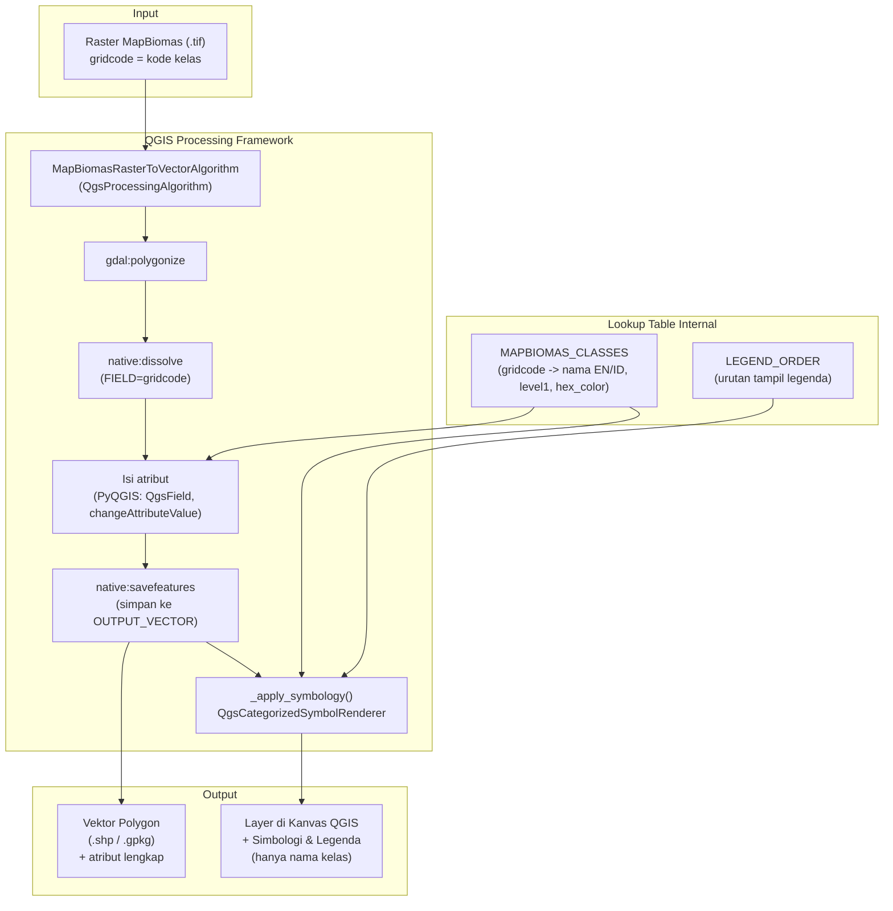
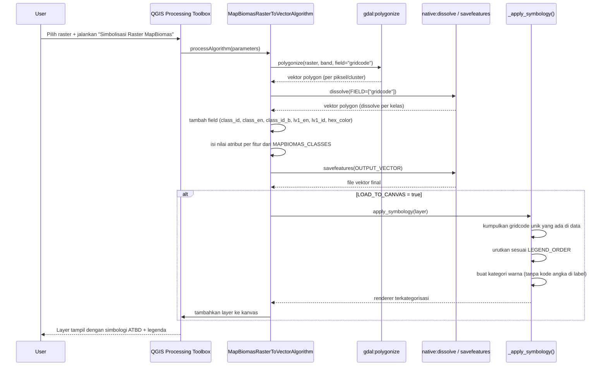

# Sistem Kerja MapBiomas ID Custom Visualization Toolbox (QGIS)

Dokumen ini menjelaskan **arsitektur, alur kerja, dan tech stack** dari tool `Simbolisasi Raster MapBiomas` untuk QGIS, serta bagaimana tool ini merujuk pada skema legenda resmi yang didefinisikan dalam **Algorithm Theoretical Basis Document (ATBD) MapBiomas Indonesia Collection 4.1**.

---

## 1. Ringkasan

Tool ini adalah **plugin/script Processing QGIS** yang mengubah raster tutupan lahan MapBiomas (nilai piksel = kode kelas / `gridcode`) menjadi **vektor polygon per kelas** — sudah di-dissolve, diberi atribut nama kelas (EN & ID), kategori level 1, kode warna resmi ATBD, dan simbologi + legenda otomatis (hanya menampilkan nama kelas, tanpa kode angka).

Tool ini **bukan** alat klasifikasi citra (tidak melakukan Random Forest/U-Net seperti pipeline asli MapBiomas) — perannya adalah tahap **post-processing & visualisasi** terhadap hasil raster MapBiomas yang sudah jadi.

---

## 2. Tech Stack

| Layer | Komponen | Fungsi |
|---|---|---|
| **Platform** | QGIS ≥ 3.x (Desktop) | Wadah eksekusi plugin, kanvas peta, manajemen layer |
| **Bahasa** | Python 3 (PyQGIS + PyQt) | Bahasa implementasi skrip Processing |
| **Framework** | QGIS Processing Framework (`QgsProcessingAlgorithm`) | Membungkus logika jadi *algorithm* yang muncul di Processing Toolbox, dengan parameter input/output standar |
| **Engine geoprocessing** | GDAL (`gdal:polygonize`) | Konversi raster → vektor polygon |
| **Engine geoprocessing** | QGIS Native Algorithms (`native:dissolve`, `native:savefeatures`) | Dissolve per kelas & penyimpanan output |
| **API data vektor** | `QgsVectorLayer`, `QgsField`, `QgsFeature`, data provider (`dataProvider()`) | Manipulasi atribut tabel (tambah field, isi nilai per fitur) |
| **API simbologi** | `QgsFillSymbol`, `QgsRendererCategory`, `QgsCategorizedSymbolRenderer` | Membuat simbologi kategorikal + legenda otomatis |
| **API proyek** | `QgsProject` | Memuat layer hasil ke kanvas QGIS |
| **Struktur data internal** | Python `dict` (`MAPBIOMAS_CLASSES`) + `list` (`LEGEND_ORDER`) | Lookup table kode kelas → nama, kategori, warna (mengikuti Tabel 5 ATBD) |
| **I/O format** | Raster: GeoTIFF (`.tif`); Vektor: Shapefile/GeoPackage (`.shp`/`.gpkg`), *temporary layer* | Format input/output yang didukung QGIS/GDAL/OGR |
| **Distribusi** | Script Processing tunggal (`.py`) + `startup.py` opsional | Cara instalasi ke QGIS (Add Script to Toolbox / autoload profil) |

---

## 3. Diagram Arsitektur Tool



---

## 4. Alur Kerja Detail (Sequence)



---

## 5. Struktur Kelas & Legenda (mengacu ATBD Collection 4.1)

Lookup table `MAPBIOMAS_CLASSES` dalam skrip **identik** dengan Tabel 5 ATBD ("*Land Cover and Land Use Classes of MapBiomas Indonesia Collection 4.1*"): 13 kelas Level 2 di bawah 5 kelas Level 1, plus kelas "Not Observed".

```mermaid
%%{init: {"theme": "base", "themeVariables": {"background": "transparent"}}, "themeCSS": ".background { fill: none !important; }"}%%
graph TD
    ROOT["Land Cover & Land Use\n(13 kelas, 2 level)"]

    ROOT --> L1F["1. Forest / Hutan"]
    L1F --> C3["3 - Forest Formation\nFormasi Hutan #1f8d49"]
    L1F --> C5["5 - Mangrove\nMangrove #04381d"]
    L1F --> C76["76 - Peat Swamp Forest\nHutan Rawa Gambut #2f7360"]

    ROOT --> L1NF["2. Non-Forest Natural Formation\nTumbuhan Non-Hutan"]
    L1NF --> C13["13 - Other Natural Vegetation\nTumbuhan Non-Hutan Lainnya #d89f5c"]

    ROOT --> L1AG["3. Agriculture / Pertanian"]
    L1AG --> C40["40 - Rice Paddy / Sawah #c71585"]
    L1AG --> C35["35 - Oil Palm / Sawit #9065d0"]
    L1AG --> C9["9 - Pulpwood Plantation\nKebun Kayu #7a5900"]
    L1AG --> C21["21 - Other Agriculture\nPertanian Lainnya #ffefc3"]

    ROOT --> L1NV["4. Non-Vegetated Area\nNon-Vegetasi"]
    L1NV --> C30["30 - Mining Pit\nLubang Tambang #9c0027"]
    L1NV --> C24["24 - Urban Area\nPermukiman #d4271e"]
    L1NV --> C25["25 - Other Non-Vegetation\nNon-Vegetasi Lainnya #db4d4f"]

    ROOT --> L1W["5. Water Body / Tubuh Air"]
    L1W --> C31["31 - Aquaculture / Tambak #091077"]
    L1W --> C33["33 - River, Lake, Ocean\nSungai, Danau, Laut #2532e4"]

    ROOT --> L1ND["6. Not Observed\nCitra Tertutup Awan #ffffff (27)"]
```



> Catatan: kode `1`, `10`, `18`, `22`, `26` pada skrip adalah kode **Level 1 (agregat)**, sedangkan kode lain (3, 5, 76, 13, 40, 35, 9, 21, 30, 24, 25, 31, 33, 27) adalah kode **Level 2 (detail)** — persis mengikuti kolom "pixel id" pada Tabel 5 ATBD.

### Tabel referensi kelas (dari ATBD, kolom yang dipakai skrip)

| Level 1 | Kelas (EN) | Kelas (ID) | pixel id | Hex |
|---|---|---|---|---|
| Forest | Forest Formation | Formasi Hutan | 3 | #1f8d49 |
| Forest | Mangrove | Mangrove | 5 | #04381d |
| Forest | Peat Swamp Forest | Hutan Rawa Gambut | 76 | #2f7360 |
| Non-Forest Natural Formation | Other Natural Vegetation | Tumbuhan Non-Hutan Lainnya | 13 | #d89f5c |
| Agriculture | Rice Paddy | Sawah | 40 | #c71585 |
| Agriculture | Oil Palm | Sawit | 35 | #9065d0 |
| Agriculture | Pulpwood Plantation | Kebun Kayu | 9 | #7a5900 |
| Agriculture | Other Agriculture | Pertanian Lainnya | 21 | #ffefc3 |
| Non-Vegetated Area | Mining Pit | Lubang Tambang | 30 | #9c0027 |
| Non-Vegetated Area | Urban Area | Permukiman | 24 | #d4271e |
| Non-Vegetated Area | Other Non-Vegetation | Non-Vegetasi Lainnya | 25 | #db4d4f |
| Water Body | Aquaculture | Tambak | 31 | #091077 |
| Water Body | River, Lake, Ocean | Sungai, Danau, Laut | 33 | #2532e4 |
| Not Defined | Not Observed | Citra Tertutup Awan | 27 | #ffffff |

---

## 6. Posisi Tool dalam Pipeline MapBiomas (Konteks ATBD)

Diagram berikut menunjukkan di mana tool QGIS ini "masuk" relatif terhadap pipeline resmi MapBiomas (Google Earth Engine → Random Forest/U-Net → Post-Classification → Integration) yang dijelaskan di ATBD Bab 3–4. Tool QGIS **berada di luar** pipeline GEE tersebut — ia bekerja setelah raster klasifikasi final diunduh/diekspor.

```mermaid
%%{init: {"theme": "base", "themeVariables": {"background": "transparent"}}, "themeCSS": ".background { fill: none !important; }"}%%
flowchart LR
    subgraph GEE["Pipeline MapBiomas (Google Earth Engine) — di luar scope tool ini"]
        M1["Landsat Mosaic\n(1990-2024)"]
        M2["Feature Space\n(156 band)"]
        M3["Classification\nRandom Forest + U-Net"]
        M4["Post-Classification\nGap Fill, Spatial, Temporal, Frequency Filter"]
        M5["Integration\n(Basic + Cross-cut Themes)"]
        M6["Raster Final\n(gridcode per piksel)"]
        M1-->M2-->M3-->M4-->M5-->M6
    end

    subgraph TOOLKIT["QGIS MapBiomas Toolbox — scope tool ini"]
        T1["Input raster (.tif)"]
        T2["Polygonize"]
        T3["Dissolve per kelas"]
        T4["Isi atribut ATBD"]
        T5["Simbologi & Legenda"]
        T6["Vektor siap analisis/peta"]
        T1-->T2-->T3-->T4-->T5-->T6
    end

    M6 -.file .tif diunduh.-> T1
```

---

## 7. Ringkasan Fungsi per Komponen Kode

| Fungsi/Class | Peran |
|---|---|
| `MAPBIOMAS_CLASSES` (dict) | Basis data kelas: `{gridcode: (nama_en, nama_id, level1_en, level1_id, hex_color)}` — sumbernya Tabel 5 ATBD |
| `LEGEND_ORDER` (list) | Urutan tampil kategori di legenda (bukan urutan numerik biasa, tapi dikelompokkan per tema) |
| `_apply_symbology(layer, field)` | Membaca nilai unik `gridcode` yang benar-benar ada di data → generate `QgsRendererCategory` per kelas → set label = nama kelas saja (tanpa kode angka) → terapkan `QgsCategorizedSymbolRenderer` |
| `MapBiomasRasterToVectorAlgorithm` | Class utama Processing: definisi parameter (`initAlgorithm`), dan urutan eksekusi (`processAlgorithm`): polygonize → dissolve → isi atribut → simpan → (opsional) muat + simbologi |

---

## 8. Format Input/Output

- **Input**: raster GeoTIFF (`.tif`) MapBiomas dengan band berisi kode kelas integer (`gridcode`).
- **Output**: vektor polygon (`.shp`/`.gpkg`/temporary), sudah di-dissolve per kelas, dengan kolom atribut:
  `gridcode`, `class_id`, `class_en`, `class_id_b`, `lv1_en`, `lv1_id`, `hex_color`.
- **Tampilan**: layer QGIS dengan simbologi kategorikal warna resmi ATBD, legenda hanya teks nama kelas.

---

*Referensi: ATBD MapBiomas Indonesia Collection 4.1 (Februari 2026) — Tabel 5 "Land Cover and Land Use Classes of MapBiomas Indonesia Collection 4.1", dan dokumen "Description of Land Cover Used in MapBiomas Indonesia Collection 4.1".*
